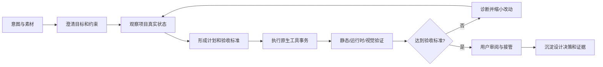

# Solers AI 辅助游戏设计：流程、理论与实现细节

状态：工作设计文档  
适用基线：Solers（Godot 4.7.1 派生版）  
读者：产品设计、游戏设计、引擎开发、Agent/LLM 开发、测试与安全人员

## 1. 文档目的

本文回答三个问题：

1. AI 在游戏设计中应当承担什么角色，人与 AI 如何分工；
2. 一次设计任务从模糊想法到可运行、可验证的 Godot 项目应经过哪些步骤；
3. Solers 当前代码如何支撑这一流程，尚缺什么，以及后续应怎样演进。

这里的“设计”不仅指生成 GDScript，也包括玩法规则、关卡与场景、视觉和声音、交互、数值、资源组织、调试、试玩、可访问性和导出约束。AI 的最终产物不是一段回答，而是带有证据、可撤销且仍兼容 Godot 的项目状态变化。

## 2. 产品定位与边界

Solers 的定位是“AI 原生的 Godot 协作式编辑器”，不是把聊天网页嵌入编辑器，也不是让模型直接接管整个工程。

人类主要负责：

- 给出创作意图、审美判断、目标玩家和不可突破的边界；
- 决定哪些方案值得保留，对高风险操作进行审批；
- 对“是否有趣、是否符合表达”作最终判断。

AI 主要负责：

- 把模糊意图转化为假设、约束、计划和可验收任务；
- 读取真实项目状态，执行重复且可结构化的编辑器操作；
- 快速产生多个低成本原型，运行、观察、诊断并迭代；
- 保存设计依据、操作记录和验证证据，降低上下文切换成本。

AI 不应被视为事实权威、美术总监或自动发布者。涉及删除、覆盖、网络、第三方代码、导出和外部成本的动作必须经过明确的能力与权限边界。

## 3. 理论基础

### 3.1 人本 AI 与混合主动协作

Solers 采用 human-in-the-loop 与 mixed-initiative 思想：人和 AI 都能提出下一步，但控制权始终可见且可收回。系统不只提供“自动/手动”两个极端，而应形成分级自主性：

| 模式 | AI 能做什么 | 人的控制点 |
|---|---|---|
| Ask | 解释、检索、诊断，不修改 | 判断答案 |
| Plan | 形成方案、风险和验收标准 | 批准或修改计划 |
| Edit | 在给定边界内修改并验证 | 审阅变更和结果 |
| Autonomous | 连续完成多步任务 | 在风险检查点审批，可随时中止 |
| Playtest | 运行、观察、诊断、提出或执行修复 | 判断体验与是否接受修复 |
| Export | 校验与构建交付物 | 批准目标、签名和发布动作 |

这避免两个常见失败：AI 只能聊天、无法完成工作；或者 AI 权限过大、用户无法理解工程为何变成现在这样。

### 3.2 设计即“假设—原型—证据—修正”

游戏设计不是一次性生成问题，而是经验性搜索问题。可以把每轮设计表达为：

```text
设计假设 H
  -> 可运行原型 P
  -> 观测证据 E（结构、日志、截图、性能、人工试玩）
  -> 与验收标准 A 比较
  -> 保留、修正或放弃
```

例如“冲刺让移动更爽”只是 H；带冷却、速度曲线和动画反馈的角色是 P；输入响应时间、碰撞错误、截图和玩家反馈是 E。只有 E 满足 A，任务才算完成。Solers 的 `done` 应表示“目标与验证闭环完成”，而不是“模型已经输出代码”。

### 3.3 受约束的生成式搜索

模型擅长扩展方案空间，但游戏项目存在硬约束：Godot 类型与生命周期、场景所有权、资源依赖、性能预算、目标平台、团队规范和已有设计决策。可将候选方案的选择近似为多目标优化：

```text
Score = w1 * 玩法目标达成度
      + w2 * 风格一致性
      + w3 * 可维护性
      + w4 * 可访问性
      - w5 * 技术风险
      - w6 * 性能与制作成本
```

权重不是让模型自行猜测的隐藏参数，而应来自用户目标、项目记忆和当前任务的验收条件。创意阶段允许发散，实现阶段必须收敛到少量可验证的候选。

### 3.4 Grounding：编辑器状态是事实源

LLM 的文字不是项目事实。Solers 应按以下优先级取证：

1. Godot 编辑器中的实时对象、场景和资源状态；
2. 已保存的项目文件与导入元数据；
3. 运行时状态、Debugger、日志、截图和性能数据；
4. 项目记忆、设计文档和用户提供的参考资料；
5. 模型的一般知识与推断。

当这些来源冲突时，系统应说明冲突并重新观察，不能用模型记忆覆盖实时状态。任何会写入的操作都应带状态前提或版本信息，避免 AI 基于旧观察覆盖用户刚完成的编辑。

### 3.5 Affordance：模型操作能力而非猜文件格式

对模型暴露的是有 schema 的领域工具，而不是无限制文件系统。场景变更优先调用 Godot 原生对象和 UndoRedo API；脚本及少量文本配置使用带哈希前置条件的补丁；资源通过 Godot importer 和 Resource API 处理。

这相当于给 AI 一组明确的编辑器“可供性”：它知道能观察什么、能改变什么、操作需要什么参数、失败如何恢复。工具越明确，模型越少依赖脆弱的 `.tscn` 文本猜测。

### 3.6 可逆事务与信任形成

用户对 Agent 的信任来自可预测性，而不是模型自称可靠。每个写操作至少需要：

- 操作前状态与并发前置条件；
- 权限等级和必要审批；
- 原子或 Godot 原生事务；
- 受影响对象、资源和文件的 receipt；
- UndoRedo、文件 checkpoint 或明确标记“不可逆”；
- 操作后的重新观察与验证。

权限、撤销策略、执行线程和敏感参数脱敏应当是工具定义的结构化元数据，不能靠工具名字符串推断。

## 4. 端到端工作流



### 4.1 意图输入

用户可以提交自然语言、选中节点、当前场景、脚本、参考图、已有素材或错误日志。输入应尽量包含：

- 目标玩家与体验目标；
- 核心机制及明确排除项；
- 2D/3D、输入设备、分辨率和目标平台；
- 美术、声音、叙事参考，以及版权或许可边界；
- 性能预算和交付范围；
- 什么现象算成功。

若信息不完整，Agent 只询问会实质改变方案的少量问题；其余内容以显式假设继续推进，并记录假设。

### 4.2 任务框定

Agent 把请求整理为一份短任务契约：

```text
目标：玩家可使用键盘和手柄完成带冲刺的 2D 移动。
范围：Player 场景、输入映射、脚本、基础反馈；不制作正式美术。
约束：Godot 4.x 标准节点；不引入第三方 addon；60 FPS。
验收：无脚本错误；四向移动可用；冲刺有冷却且不穿墙；键盘/手柄均可触发。
假设：角色为 CharacterBody2D，已有碰撞体。
```

模糊的审美目标也需要转成可观察代理，例如“压迫感”可落到视野范围、对比度、环境声密度、敌人出现节奏等，但系统必须标注这些只是代理，不等同于人的体验判断。

### 4.3 上下文采集与预算

上下文不应把整个项目无差别塞给模型。建议分层：

- 始终携带：任务契约、当前计划、权限、项目版本/场景 revision；
- 高优先级：选中对象、活动场景树、相关脚本符号和近期错误；
- 按需检索：资源依赖、ClassDB 属性、输入映射、项目设置、导出 preset；
- 证据附件：最新且与当前 revision 绑定的截图、日志摘要和测试结果；
- 长期记忆：已确认的设计原则、命名规范、平台预算和被否决方案。

Solers 当前已实现 Micro/Full Compaction、typed transcript、参考图保留和大型工具结果压缩。压缩必须保存未完成计划、重要约束、变更 receipt、验证失败和下一步，不能只生成聊天摘要。

### 4.4 计划与风险分解

计划应按“可独立验证的垂直切片”拆分，而不是按文件罗列。典型顺序是：

1. 观察现状并确认前置条件；
2. 建立最小机制；
3. 保存并做静态检查；
4. 运行并采集证据；
5. 修复阻断问题；
6. 添加反馈和可访问性细节；
7. 回归验证并总结。

每步包含预期状态、可能写入、风险、验证方法和失败回退。Agent 可通过 `update_plan` 更新可恢复快照；计划是动态控制结构，不是开工前写完便不再变化的说明文字。

### 4.5 执行

推荐的工具选择顺序：

1. 先查询对象、ClassDB 或资源契约；
2. 场景和资源优先走原生事务；
3. 脚本采用精确 patch，并提供 observed hash；
4. 每个逻辑批次后保存和重新观察；
5. 工具返回 pending 时使用原调用的 wait/resume 契约，不重复启动后台任务；
6. 网络素材、插件安装、运行和导出走对应权限门。

不要在一个巨大调用里同时创建场景、改脚本、下载素材并导出。较小的事务更容易定位失败、撤销和复用证据。

### 4.6 验证闭环

验证应从廉价、确定的检查逐步升级：

| 层级 | 检查 | 典型证据 |
|---|---|---|
| 结构 | 节点类型、属性、资源依赖、信号连接 | 对象查询结果、receipt |
| 静态 | 脚本解析、类型与项目设置 | diagnostics、错误日志 |
| 行为 | 启动场景、状态变化、断言 | smoke test、运行日志 |
| 视觉 | 构图、遮挡、材质、UI 边界 | 与 scene revision 绑定的截图 |
| 性能 | 帧时间、draw calls、内存、加载时间 | 性能采样与预算比较 |
| 体验 | 可读性、节奏、趣味、情绪 | 人工试玩记录、遥测或 A/B 结果 |
| 交付 | preset、依赖和目标平台 | export validation/build receipt |

视觉模型只能辅助发现明显问题，不能证明“好看”或“有趣”。截图也必须满足时效性：若捕获期间场景已变化，旧图不能作为当前版本的通过证据。当前 `SolersObservationService` 已对捕获源变化、运行时 epoch、渲染收敛帧和调试显示模式给出检查或警告。

### 4.7 结果交付

完成报告至少说明：

- 做了什么，以及为什么；
- 影响了哪些场景、资源、脚本或设置；
- 哪些验收项已通过，对应证据是什么；
- 仍有哪些警告、主观判断或未验证平台；
- 如何撤销，用户接下来最值得人工检查什么。

只有全部必需验收项完成或用户明确接受剩余风险时才调用 `done`。普通说明文字或“代码看起来正确”不构成完成。

## 5. 按设计领域展开

### 5.1 玩法与脚本

流程是“输入/状态/规则建模 → 最小可玩机制 → 边界条件 → 反馈 → 回归”。Agent 应先确认节点职责和状态机，再写脚本；避免把移动、动画、音效、UI 和存档塞进单一脚本。关键参数应暴露为导出属性或 Resource，方便设计师手调。

验证重点包括输入丢失、帧率相关逻辑、碰撞穿透、状态不可达、信号重复连接、暂停行为以及键鼠/手柄一致性。

### 5.2 场景与关卡

AI 更适合先生成灰盒和约束满足的布局，再逐步装饰。流程为：建立尺度与动线约束、生成房间/平台、检查可达性和碰撞、从多个相机视角捕获、人工评估节奏，然后才替换正式资产。

程序化生成应记录 seed、生成参数和规则版本，保证问题可重现。导航烘焙成功只能证明路径存在，不能证明路线有趣。

### 5.3 美术与资产

资产工作应区分“搜索已有合法资产、生成临时资产、生成正式候选、Godot 导入和场景落位”。每个外部资产需要来源、许可证、模型/服务、生成参数、修改历史和允许用途。远程生成是有成本的网络操作，必须可预览、可取消、可重试且避免重复提交。

导入后仍需检查比例、pivot、碰撞、材质通道、纹理压缩、LOD、动画命名和目标平台预算。视觉一致性比单个资产质量更重要，应由项目风格约束和人工审美把关。

### 5.4 UI、文本与可访问性

AI 可生成控件树、主题候选、响应式布局和本地化占位，但应在多分辨率、长文本、字体回退、键盘/手柄焦点和缩放条件下验证。颜色对比、字幕、减少动态效果和输入重映射应进入验收标准，而不是最后补丁。

### 5.5 音频、动画与反馈

设计重点是事件与反馈语义：何时触发、能否中断、混音优先级、循环边界、动画状态转换和 gameplay 状态是否一致。AI 可建立连接和基础参数，但节奏与力度最终需要人在运行环境中判断。

### 5.6 调试、试玩与平衡

Playtest Agent 的闭环是：复现步骤 → 运行 → 获取日志/截图/状态 → 提出最小解释 → 做最小修复 → 用相同步骤回归。一次只改变少量变量，避免“修好但不知道为什么”。

数值平衡可用模拟和遥测缩小搜索空间，但模型不应根据少量局部数据宣称全局平衡。要保存参数集、随机种子、样本规模和评价指标，并将玩家定性反馈与数值指标分开呈现。

## 6. Solers 当前实现映射

以下是基于当前仓库代码的现状，不是未来愿景：

| 流程能力 | 当前实现位置 | 作用 |
|---|---|---|
| 编辑器入口 | `editor/solers_editor_plugin.*`、`solers_dock.*` | 原生 Dock、会话与用户交互 |
| Agent 循环 | `core/solers_agent_session.*` | 流式响应、工具队列、审批、等待、压缩、完成语义 |
| 上下文 | `core/solers_context_manager.*` | token 预算、Micro/Full Compaction、附件投影 |
| 工具契约 | `core/solers_tool.h`、`solers_tool_registry.*` | schema、暴露级别、执行线程、资源访问、撤销和权限元数据 |
| 真实观察 | `core/solers_observation_service.*`、`solers_reflection_service.*` | 编辑器/运行时状态、对象关系、日志、性能与版本化截图 |
| 项目修改 | `solers_script_service.*`、`solers_resource_service.*` | 脚本、文件、资源及状态前置条件 |
| 可恢复性 | `solers_file_checkpoint.*`、`solers_action_timeline.*` | 文件 checkpoint、事件审计及 Godot UndoRedo 对接 |
| 权限安全 | `solers_permission_manager.*`、`solers_secret_store.*` | 分级能力、一次性批准、敏感信息保护 |
| 模型接入 | `llm/`、`solers_provider_registry.*` | 多 provider、协议适配、重试、BYOK 与本地模型 |
| 素材扩展 | `solers_asset_service.*`、`plugins/` | 素材能力、异步任务及外部服务插件 |
| 专业知识 | `skills/`、`solers_builtin_skills.*` | 按 Godot 领域按需加载指导，减少基础 prompt 膨胀 |
| 外部互操作 | `protocol/solers_mcp_adapter.*`、`solers_rpc_server.*` | MCP-compatible 工具面和显式启用的本地 RPC |

当前体系的关键优点是：编辑器主线程仍是场景事实的权威写者；工具明确声明资源读写集合，能够安全调度；后台素材和截图采用 pending/resume；场景 receipt 与渲染证据绑定 revision，降低“看的是旧画面”问题。

需要继续验证和完善的部分包括：完整 action-scoped rollback、自动化输入与可重放试玩、设计记忆的显式 UI、跨平台视觉/性能矩阵、资产许可账本、成本预算、体验型验收的人工反馈入口，以及生产级发布审批链。

## 7. 权限、安全与隐私

当前权限域包括 observe、edit_scene、edit_files、run_project、export_build、network、install_plugin 和 shell。建议产品层采用以下规则：

- 观察默认允许，但读取内容仍限制在项目边界并遵守敏感文件规则；
- 场景和文件编辑按会话或任务授权，receipt 必须可见；
- 网络请求显示 provider、目的、预计上传内容和可能成本；
- 第三方插件安装始终逐次批准，并在启用前检查来源和代码；
- shell 不因“自主模式”自动放开；命令、工作目录和输出都进入审计；
- export 与签名/上传分离，构建成功不等于允许发布；
- API key 不进入 prompt、timeline、普通日志或工具返回；
- 本地模型模式应明确哪些数据仍可能由素材插件或遥测发送到网络。

提示词注入不仅来自聊天，也可能藏在 README、导入资产、插件说明或远程搜索结果中。外部内容只能作为数据，不能自行改变系统权限、审批规则和工具契约。

## 8. 失败模式与处理策略

| 失败模式 | 表现 | 防护 |
|---|---|---|
| 幻觉 API/属性 | 写入不存在的 Godot 类或属性 | 先查询 ClassDB/对象契约，再调用类型化工具 |
| 旧状态覆盖 | 用户编辑后 AI 仍按旧场景写入 | revision/hash 前置条件，冲突后重新观察 |
| 只生成不验证 | 代码存在但项目不能运行 | `done` 前强制匹配验收证据 |
| 无边界重构 | 为小功能修改大量无关文件 | 任务范围、资源访问集、小事务与 diff/receipt |
| 反复启动异步任务 | 重复付费或产生多个资产 | pending id、wait/resume、幂等键 |
| 截图误判 | 旧帧、调试视图或未收敛渲染被当成结果 | revision/epoch receipt、帧门控和警告 |
| 撤销不完整 | 场景撤销了但文件或外部任务未恢复 | 每工具声明撤销策略；不可逆动作提前提示 |
| 上下文漂移 | 长任务忘记目标或已拒绝方案 | typed transcript、计划快照、压缩保留关键决策 |
| 提示注入 | 项目文件要求泄露密钥或绕过审批 | 权限与 prompt 分离、内容来源标记、秘密隔离 |
| “指标正确但不好玩” | 技术测试通过，体验仍差 | 把人工试玩设为体验型任务的必需验收项 |

## 9. 评价指标

不要只统计模型回答满意度。建议同时追踪：

- 任务完成率：全部必需验收项有证据的比例；
- 首轮闭环率：无需人工修复即可运行并验证的任务比例；
- 人工接管成本：完成任务所需手动操作数与修改时间；
- 回归率：AI 修改导致既有测试、场景或导出失败的比例；
- 撤销成功率：用户能恢复到操作前一致状态的比例；
- 错误审批率：不必要审批与漏审批的比例；
- 状态冲突率：被 revision/hash 拦截的过期写入比例；
- 证据新鲜度：完成时证据是否对应最终 revision；
- 延迟、token、远程调用和素材生成成本；
- 设计质量：由目标玩家试玩量表、留存/完成率等项目指标衡量，而非模型自评。

测试集应覆盖固定微任务、真实纵向切片和破坏性红队场景，并固定 Godot 版本、项目快照、模型配置、随机种子及验收器版本，保证结果可比较。

## 10. 推荐演进路线

### 阶段 A：可靠的协作编辑

- 固化 Ask/Plan/Edit 的产品语义；
- 为高频玩法、场景、UI 任务建立可执行验收模板；
- 完善 action-scoped rollback 与 receipt 展示；
- 用真实项目回归测试 revision、UndoRedo、脚本 patch 和截图证据。

### 阶段 B：可重放 Playtest

- 增加输入序列录制/回放、运行时断言和稳定截图点；
- 把日志、对象状态、截图和性能样本归一为一次 playtest report；
- 允许用户对主观问题作结构化标注，反馈进入下一轮计划。

### 阶段 C：设计记忆与多候选实验

- 建立用户可编辑的项目设计记忆，而非不可见的向量记忆；
- 支持分支式原型、参数集、seed 和候选对比；
- 为资产来源、许可证、生成成本建立项目级账本。

### 阶段 D：交付与团队治理

- 建立平台构建矩阵、性能预算和发布审批链；
- 支持团队角色权限、共享决策记录和 CI 证据；
- 保持 Solers 改动集中在模块与少量明确内核接口，持续跟踪 Godot upstream。

## 11. 建议的用户任务模板

```text
目标体验：
目标玩家：
当前场景/选中对象：
必须实现：
明确不做：
玩法与美术参考：
目标平台和输入设备：
性能/尺寸/依赖约束：
允许使用网络素材或生成服务：是/否
允许修改的目录或场景：
验收步骤：
需要我审批的节点：
```

示例：

```text
为当前 3D 测试场景制作一个灰盒巡逻敌人。玩家进入 8 米范围后追击，
丢失视线 3 秒后返回巡逻。只修改 res://prototype/enemy/，不下载素材，
不改全局渲染设置。验收时运行测试场景，证明巡逻、追击、丢失和返回四种
状态可达；无脚本错误；导航失败时不能穿墙。先给计划，场景与文件写入可按
本任务自动批准，任何插件、网络或 shell 操作仍需逐次批准。
```

## 12. 设计准则总结

Solers 的 AI 辅助设计能力应围绕一个原则建设：**把生成能力包在真实状态、明确权限、可逆事务和验证证据之中**。

其最小可信闭环不是“用户提问 → 模型回答”，而是：

```text
用户意图
→ 明确目标、约束与验收
→ 读取实时 Godot 状态
→ 形成可恢复计划
→ 调用类型化原生工具
→ 保存 receipt 与撤销点
→ 运行并收集结构/日志/视觉/性能证据
→ 未通过则诊断迭代
→ 人工审阅后完成
```

创意的开放性与工程的确定性并不冲突：模型负责扩大可能性，Godot 状态和测试负责收敛，人类负责价值与审美判断。三者缺一，系统都只能是聊天助手，而不是可信的 AI 原生游戏设计环境。
