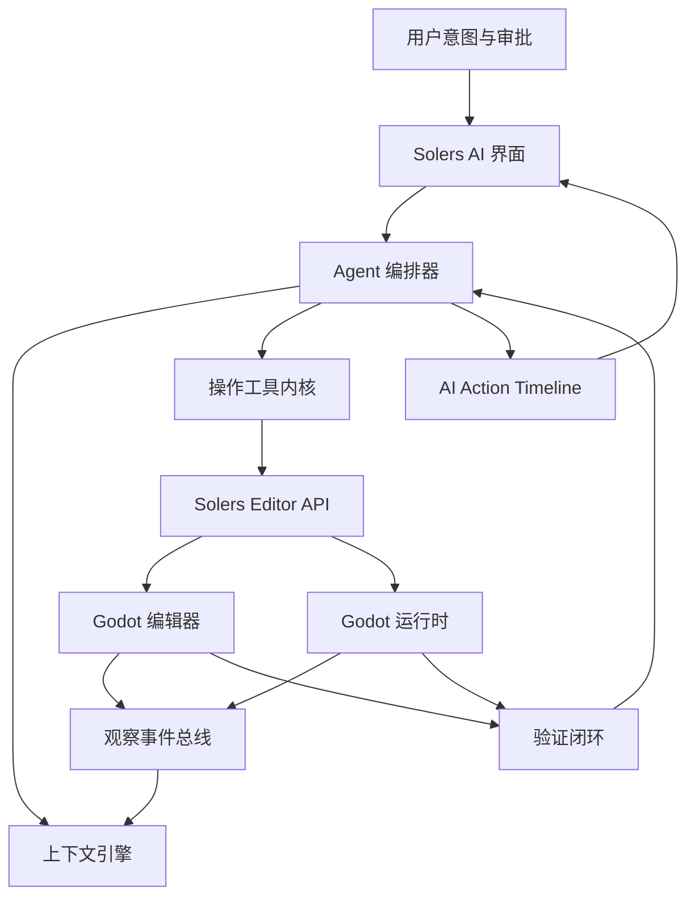

# Solers 架构与开发执行规划

版本：0.1  
日期：2026-06-06  
基础引擎目标：优先基于 Godot 4.6.3-stable，开发过程中持续跟踪 Godot 4.7

## 1. 产品核心判断

Solers 是一个兼容 Godot 的 AI 原生游戏引擎发行版。它不是一个聊天插件，也不是一个只会改代码的外部 AI 编程助手。Solers 的核心产品思想是：让 AI 成为引擎内部的一等操作者，能够像人类开发者一样观察、修改、运行、验证和导出项目，并且所有操作都发生在真实的编辑器与运行时状态之上。

用户负责提供想法、需求、约束、参考资料、开发素材和关键审批；Solers 负责把这些意图转化为引擎原生操作，覆盖场景、脚本、资源、项目设置、导入设置、运行调试、测试验证和构建导出。

Solers 的长期目标是让 AI 可以操控约 90% 的实用 Godot 编辑器工作流，同时保证用户拥有项目所有权、保持 Godot 项目兼容性，并且随时可以回到人工精修。

## 2. 不可妥协的设计原则

1. Godot 兼容性优先。  
   Solers 项目应尽可能保持为标准 Godot 项目：`.godot`、`.tscn`、`.scn`、`.tres`、`.res`、`.gd`、`.cs` 和标准 export preset 都应继续可用。除非某个能力明确标记为 Solers-only，否则项目应该可以被上游 Godot 打开和维护。

2. AI 操作必须可观察、可撤销、可审计。  
   每个有意义的 AI 操作都应该进入 Action Timeline，并尽可能接入 Godot 的 undo/redo。操作记录应包含结构化输入、输出、影响对象、差异、日志和验证结果。

3. 优先使用引擎操作，而不是直接改文件。  
   AI 不应该主要靠手写 `.tscn` 或 `.tres` 文本来修改项目。正确路径是调用 schema 化的工具，由工具使用 Godot 编辑器/运行时 API 执行操作。脚本、配置和少数受控 fallback 场景可以使用文本补丁。

4. 工具面要少而精。  
   30 到 40 个高质量、可组合、schema 清晰的工具，胜过 150 个浅层泛工具。工具数量不是护城河，工具质量和编排质量才是。

5. BYOK 是底线。  
   Solers 应支持用户自带 OpenAI、Anthropic、Google、xAI、DeepSeek、Qwen、Ollama、LM Studio 或企业私有网关密钥，而不是把用户锁定到单一模型供应商。

6. 验证是生成的一部分。  
   一次 Solers agent run 不应停在“改完了”。它至少要检查语法、场景有效性、编辑器错误、运行时日志、必要时的视觉输出，以及目标平台可行时的导出检查。

7. 能用插件验证的，不急着深 fork。  
   先做薄 fork 和编辑器插件。只有当公开插件 API 阻碍稳定性、用户体验、性能或安全时，才把能力下沉到 C++ fork 层。

## 3. 高层架构



Solers 的核心闭环是：

意图 -> 计划 -> 引擎原生操作 -> 状态观察 -> 自动验证 -> 用户可理解的结果。

## 4. 系统分层

### 4.1 Solers 发行版层

这一层负责 Solers 作为独立引擎发行版的基础能力：

- 产品名称、图标、启动画面、About 对话框、设置路径和更新通道。
- Windows、macOS、Linux 构建配置，后续扩展 Android/Web editor 变体。
- stable、preview、nightly 发布通道。
- Godot upstream 分支跟踪与 rebase 策略。
- Godot license、copyright 和第三方依赖归因。

初期应尽量保持修改少而清晰。第一个里程碑不是“AI 多强”，而是一个能稳定构建、启动、打开项目、运行项目的 Solers-branded Godot fork。

### 4.2 Solers 编辑器外壳

这一层是用户直接看到的 AI 原生体验：

- AI chat / command dock。
- AI Action Timeline。
- BYOK 与 provider 设置。
- 模型、成本、延迟提示。
- 敏感操作审批弹窗。
- 文本 diff 与场景变更预览。
- Agent run 状态：运行中、暂停、取消、恢复。
- 验证后的建议下一步。

MVP 阶段可以先做 dock。成熟产品阶段，Solers 应该把 AI 操作变成编辑器全局能力，而不是一个贴在角落里的网页窗口。

### 4.3 Agent 编排器

编排器负责协调模型调用、工具调用、上下文、用户审批和验证流程。它应保持模型无关，并支持多种执行模式：

- Ask mode：只回答项目问题，不修改文件。
- Plan mode：生成执行计划，等待用户批准。
- Edit mode：执行边界明确的修改，并自动验证。
- Autonomous mode：执行多步骤任务，中途设置审批检查点。
- Playtest mode：运行游戏、读日志、看截图、提出修复。
- Export mode：准备 export preset、运行导出检查、打包构建。

编排器不应该是一条巨型 prompt，而应该是显式状态机：有阶段、有结构化产物、有失败恢复策略。

### 4.4 上下文引擎

上下文引擎负责把项目与编辑器状态压缩成模型能使用的高价值上下文。必要上下文来源包括：

- 当前打开的场景和 active scene root。
- 场景树摘要。
- 当前选中节点、Inspector 属性、groups、signals 和绑定脚本。
- 资源依赖图。
- Project Settings 和 Input Map。
- 文件树与最近变更。
- 脚本符号、诊断、解析错误和测试结果。
- 编辑器输出、debugger 输出、运行时日志和 crash 信息。
- 编辑器 viewport 与运行中游戏截图。
- Export presets 与目标平台设置。
- Project memory：玩法目标、美术风格、机制约束、命名规范、长期设计决策。

上下文必须有优先级。大型二进制资源、完整场景文件和长日志默认应摘要化或以资源链接形式提供，只有需要时再展开。

### 4.5 操作工具内核

工具内核把引擎动作暴露为类型明确、安全、可审计的操作。每个工具都应该具备：

- 稳定名称。
- JSON Schema 输入/输出。
- 权限等级。
- 可行时支持 dry-run。
- 结构化成功/失败结果。
- 受影响的节点、资源、文件链接。
- Timeline 事件输出。
- 尽可能接入 undo/redo。

MVP 应优先实现 30 到 40 个高价值工具。不要在编排质量没成熟之前堆出巨大工具列表。

### 4.6 Solers Editor API

Solers Editor API 是工具内核与 Godot 编辑器之间的内部桥。最初可以主要由 Godot editor plugin 实现；当插件层遇到边界，再把能力下沉到 C++ fork patch。

关键 Godot 集成点包括：

- `EditorInterface`
- `EditorPlugin`
- `EditorUndoRedoManager`
- `EditorFileSystem`
- `ScriptEditor`
- `EditorInspector`
- `EditorSelection`
- `EditorResourcePreview`
- `EditorRunBar`
- `EditorExport`
- `ProjectSettings`
- `InputMap`
- 编辑器 debugger 与运行时 Remote Scene Tree
- 2D/3D viewport 截图能力

### 4.7 观察事件总线

观察事件总线把编辑器与运行时状态流式反馈给 AI 系统：

- 场景切换。
- 选中节点变化。
- 文件变化。
- 脚本保存。
- 资源导入完成。
- 错误日志出现。
- Play session 启动/停止。
- Debugger breakpoint/error。
- Export 启动/完成/失败。
- 资产生成/导入。
- 用户接受或拒绝 AI 变更。

事件总线应输出结构化事件，而不是只输出一团文本日志。

### 4.8 验证闭环

验证是 Solers 的核心产品能力，应包括：

- GDScript 解析和 language server diagnostics。
- 使用 .NET 构建时的 C# build check。
- 资源加载检查。
- 缺失依赖检查。
- 场景实例化检查。
- 运行时 smoke test。
- 截图捕获。
- Console/error log 分析。
- 项目已有单元测试/集成测试。
- 可行时的导出 dry-run 或导出 smoke check。

验证结果应简洁明确：

- 通过。
- 通过但有警告。
- 失败并给出可操作错误。
- 结果不确定，并说明原因。

## 5. MVP 工具面

### 5.1 项目工具

- `project.get_summary`
- `project.get_file_tree`
- `project.search_files`
- `project.read_file`
- `project.write_file`
- `project.get_settings`
- `project.set_setting`
- `project.get_input_map`
- `project.set_input_action`

### 5.2 场景工具

- `scene.list_open`
- `scene.open`
- `scene.create`
- `scene.save`
- `scene.get_tree`
- `scene.get_selected_nodes`
- `scene.select_node`
- `scene.add_node`
- `scene.delete_node`
- `scene.rename_node`
- `scene.move_node`
- `scene.duplicate_node`
- `scene.set_node_property`
- `scene.get_node_properties`
- `scene.connect_signal`
- `scene.instantiate_scene`

### 5.3 资源工具

- `resource.list_dependencies`
- `resource.load`
- `resource.create`
- `resource.set_property`
- `resource.import_file`
- `resource.reimport`
- `resource.preview`

### 5.4 脚本工具

- `script.create`
- `script.read`
- `script.write`
- `script.patch`
- `script.open_in_editor`
- `script.get_symbols`
- `script.get_diagnostics`

### 5.5 运行与调试工具

- `run.play_current_scene`
- `run.play_main_scene`
- `run.stop`
- `run.get_status`
- `run.get_logs`
- `run.capture_screenshot`
- `run.get_remote_scene_tree`
- `run.call_remote_method`，仅在高权限下开放

### 5.6 验证工具

- `verify.gdscript`
- `verify.scene_load`
- `verify.run_smoke_test`
- `verify.visual_snapshot`
- `verify.export_preset`

### 5.7 导出工具

- `export.list_presets`
- `export.create_preset`
- `export.update_preset`
- `export.export_debug`
- `export.export_release`

## 6. 权限模型

Solers 应按风险给每个工具分级。

### Tier 0：只读操作

示例：检查场景树、读取日志、读取项目设置、截图。

默认策略：用户启用当前项目后，不需要每次单独审批。

### Tier 1：本地可撤销编辑

示例：添加节点、设置属性、创建脚本、编辑资源、连接 signal。

默认策略：在一次已批准的 agent run 内允许执行，并进入 timeline 与 undo/redo。

### Tier 2：大范围项目变更

示例：批量重构、删除资源、重写多个场景、修改导入设置、修改导出配置。

默认策略：必须先展示计划和影响范围，由用户批准。

### Tier 3：外部或高成本操作

示例：联网生成资产、调用付费模型、安装依赖、执行外部命令、Steam 上传、签名、云存储。

默认策略：明确提示成本、安全影响和目标，再请求用户审批。

### Tier 4：危险操作

示例：删除项目目录、覆盖无关文件、发布正式构建、上传凭据、运行任意 shell 命令。

默认策略：默认阻止，除非用户给予一次性、范围明确的授权。

## 7. AI Action Timeline

Action Timeline 是 Solers 的标志性功能之一。它应记录：

- 用户原始请求。
- Agent 计划。
- Tool call 及结构化参数。
- 受影响的文件、节点、资源和设置。
- 前后状态摘要。
- 文本文件 diff。
- 引擎原生场景操作摘要。
- 验证尝试与结果。
- 用户批准/拒绝。
- rollback handle。

Timeline 需要支持：

- 展开/收起。
- 跳转到受影响节点或文件。
- 在安全时撤销单个操作。
- 重新运行验证。
- 保存为 project memory。
- 导出为 debug/support bundle。

## 8. Intent-to-Scene Compiler

Solers 不应把所有 prompt 都当成代码生成任务。对游戏开发来说，更好的中间表示是 scene/gameplay blueprint。

示例流程：

1. 用户说：“做一个 top-down survival prototype，有玩家、敌人、拾取物、血量和 wave timer。”
2. Planner 生成 gameplay blueprint：
   - 场景：`Main`、`Player`、`Enemy`、`Pickup`、`HUD`
   - 输入：move、attack
   - 资源：placeholder sprite/material
   - 脚本：移动、敌人 AI、spawn manager、health
   - 验证标准：玩家能移动，敌人能生成，血量能减少
3. Scene Builder 调用 scene/node/resource tools。
4. Script Engineer 编写脚本。
5. Playtester 运行场景，检查日志和截图。
6. Agent 修复失败点。
7. 用户得到一个可玩的 prototype 和清晰总结。

blueprint 应保存到 project memory，并随着游戏演进持续更新。

## 9. 多 Agent 分工

初期不必真的启动多个进程，可以先用一个 orchestrator 加多角色 prompt。只有当需要并发、隔离或模型专长时，再拆成独立 worker。

推荐角色：

- Planner：把用户意图拆成可执行任务。
- Scene Builder：操作场景树和资源。
- Script Engineer：编写和重构 GDScript/C#。
- Asset Curator：导入、生成、追踪和管理资产 license。
- Playtester：运行游戏、查看日志/截图、报告行为。
- Export Engineer：管理 export preset 和构建检查。
- Reviewer：检查回归、缺失测试、不安全操作和风格问题。

每个角色都应输出结构化结果。不要让 agent 之间主要靠长篇自然语言互相传话。

## 10. BYOK 与模型网关

BYOK 网关应支持：

- OpenAI-compatible API。
- Anthropic。
- Google Gemini。
- DeepSeek。
- Qwen。
- xAI。
- Ollama。
- LM Studio。
- 企业自定义 HTTP 网关。

必要能力：

- 每个 provider 的 API key 存储。
- 每个项目的 provider 偏好。
- 高成本 run 前的成本预估。
- token/cost 历史。
- privacy mode。
- local-only mode。
- 模型能力登记：文本、视觉、代码、长上下文、tool calling、structured output、图像生成、音频生成。
- 模型失败时的 fallback 策略。

Solers 不应假设所有模型的 tool calling 质量一致。编排器需要 provider adapter，并对模型输出做 schema validation 与修复。

## 11. 资产流水线

Solers 应把资产当成项目一等对象，而不是随机文件。

资产来源：

- 用户本地提供。
- Godot Asset Store。
- Kenney assets。
- OpenGameArt。
- AI 生成的贴图、sprite、模型、音频和动画。
- 工作室/团队私有资产库。

每个资产应记录：

- 来源。
- License。
- Attribution。
- AI 生成时的 prompt。
- AI 生成时使用的模型/provider。
- Import settings。
- 关联场景/资源。
- 可替换候选项。

Asset-aware Agent 不应盲目导入资产。license 和 source metadata 对商业用户非常关键。

## 12. Fork 策略

### 12.1 从薄 fork 开始

初始 fork 修改范围：

- 品牌。
- 构建元信息。
- Solers dock 注册。
- BYOK 设置页。
- 内置 Solers AI 插件。
- license 与 attribution 打包。

### 12.2 只在稳定边界做 C++ patch

当出现以下情况，再把能力下沉到 C++：

- 插件 API 缺失。
- GDScript 插件实现性能不足。
- UI 集成明显像外部外挂。
- undo/redo 集成不可靠。
- 运行时或编辑器状态拿不到。
- 安全策略需要引擎层强约束。

### 12.3 维护 Rebase Ledger

每个 fork patch 都要分类：

- Branding。
- Build/distribution。
- Editor UI。
- Solers API。
- Agent/tool runtime。
- 可 upstream 的 Godot 改进。
- 临时 workaround。

能 upstream 的修复应尽量回馈 Godot。这既降低长期 fork 成本，也建立生态信任。

## 13. 开发阶段规划

### Phase 0：源码基线与薄 fork

目标：从 Godot 构建出一个品牌化但改动很薄的 Solers editor。

任务：

- Clone Godot 源码。
- Checkout `4.6.3-stable`。
- 本地构建 editor。
- 先写清 Windows 构建步骤。
- 在不滥用 Godot 商标的前提下替换发行版品牌。
- 添加 `SOLERS_VERSION`。
- 添加 `thirdparty/GODOT_COPYRIGHT.txt` 或等价 attribution 打包。
- 添加占位 Solers dock。
- 后续再补 CI build matrix。

退出标准：

- Solers editor 能启动。
- 能打开标准 Godot 项目。
- 能创建/保存场景。
- 能运行场景。
- Godot docs/license attribution 保留完整。

### Phase 1：插件优先的 AI 控制原型

目标：用插件和本地 bridge 证明 live editor control 可行。

任务：

- 实现 editor plugin。
- 暴露本地 WebSocket 或 MCP-compatible bridge。
- 实现 30 到 40 个 MVP tools。
- 添加结构化 tool schemas。
- 添加基础 BYOK 设置。
- 添加 Action Timeline MVP。
- 添加日志和截图观察能力。
- 实现场景树、脚本、资源、项目设置操作。
- 实现基础验证闭环。

退出标准：

- 通过自然语言，Solers 能创建一个简单 2D game prototype。
- AI 能添加节点、写脚本、运行场景、检查错误并修复。
- 用户能检查每个 AI 动作。
- 大部分场景编辑都可 undo。

### Phase 2：核心 Solers Editor API

目标：把脆弱的插件边界变成可靠的引擎内 API。

任务：

- 添加 C++ command bus。
- 添加 scene operation transaction API。
- 添加稳定 viewport screenshot API。
- 添加结构化 editor observation events。
- 添加 export hooks。
- 提升 undo/redo 覆盖率。
- 暴露缺失的 script diagnostics 与 debugger 数据。
- 为核心操作添加 API tests。

退出标准：

- Tool calls 不再依赖脆弱 UI simulation。
- AI 可以稳定操作 active scene 和 runtime state。
- 重复 agent run 具备足够确定性，可做回归测试。

### Phase 3：Agent 产品化

目标：让 Solers 成为真正可日常使用的游戏创作环境。

任务：

- 实现稳定 planner/executor/verifier loop。
- 添加 project memory。
- 添加角色化 agents。
- 添加 intent-to-scene blueprint artifact。
- 添加视觉验证。
- 添加 template 与 skill pack 系统。
- 添加 onboarding。
- 添加项目 backup/checkpoint UX。

退出标准：

- 新用户可以从一句 prompt 创建可玩的 prototype。
- 有经验的用户可以要求精确改动，同时不失控。
- Agent 能自主修复常见脚本和运行时错误。
- Solers 能产出清晰总结和下一步建议。

### Phase 4：Cloud/Local 双模式与商业层

目标：支持严肃 solo developer 和团队。

任务：

- 添加 cloud tasks，用于长时间生成/测试。
- 添加 local-only privacy mode。
- 添加团队共享 memory 和 style rules。
- 添加私有资产库。
- 添加组织级 model gateway。
- 添加付费 skill/template marketplace。
- 添加 opt-in telemetry，用于质量改进。

退出标准：

- 团队可以跨项目标准化 Solers 行为。
- 敏感项目可以本地或私有化运行。
- Solers 有不依赖强卖 API 调用的商业化路径。

## 14. 测试策略

### 14.1 引擎兼容性测试

- 打开上游 Godot demo projects。
- 保存并重新打开场景。
- 检查项目文件是否仍保持 Godot-compatible。
- 对目标平台导出 debug build。

### 14.2 Tool Contract Tests

每个工具都应测试：

- 合法输入。
- 非法输入。
- 缺失 scene/project state。
- 权限拒绝。
- 可用时的 undo/redo。
- 结构化输出符合 schema。

### 14.3 Agent Scenario Tests

标准场景：

- 创建 2D platformer prototype。
- 创建 top-down movement prototype。
- 给已有场景添加 UI HUD。
- 添加 input actions。
- 导入资产并绑定到节点。
- 修复 GDScript 语法错误。
- 修复运行时 null reference。
- 导出 desktop debug build。

### 14.4 视觉回归测试

截图测试覆盖：

- Editor dock layout。
- 生成场景的视觉状态。
- Runtime smoke test output。
- 错误 overlay。

视觉测试需要容忍一定差异。游戏渲染可能因平台和 GPU 有变化。

## 15. 安全与隐私

主要风险：

- AI 删除或破坏用户项目。
- AI 把私有代码/资产泄漏给模型供应商。
- AI 执行危险外部命令。
- 恶意资产/插件对 agent 做 prompt injection。
- Provider keys 存储不安全。
- 生成资产带来 license/copyright 风险。

缓解策略：

- 大范围编辑前自动创建项目 backup/checkpoint。
- 工具权限分级。
- 外部命令必须显式审批。
- 尽可能用操作系统 credential storage 加密 provider keys。
- 每项目 privacy mode。
- 对日志、资产 metadata、第三方文档做 prompt-injection 过滤。
- 不把项目文件中读到的文本盲目当作指令。
- 导入/生成资产必须记录 license metadata。
- 支持 audit log 导出。

## 16. 法律与许可说明

Godot 使用 MIT license。Solers 可以修改和再发行 Godot，也可以商业化，只要保留 license 与 copyright notices。

商标约束非常重要：

- 不要把产品命名为 “Godot AI” 或类似名称。
- 不要使用 Godot logo 作为 Solers 品牌。
- 可以谨慎使用 “compatible with Godot” 或 “built on Godot Engine”，但要附带 attribution 和免责声明。
- 除非存在明确合作关系，否则应声明 Solers 不隶属于 Godot Foundation，也未被 Godot Foundation 官方背书。

AI 生成资产和第三方资产需要独立 license 管理。

## 17. 竞争定位

### Godot AI MCP / Godot MCP Pro

它们是外部 assistant 到 Godot 的桥。Solers 应该是引擎发行版，拥有原生状态、原生 UX、验证闭环、timeline 和可控操作 API。

### Ziva

Ziva 是 in-editor agent。Solers 要更底层：AI 是引擎一等操作者，而不只是 assistant dock。

### Summer Engine

Summer 是最接近的品类竞品。Solers 应从 BYOK、开放工程、私有化部署、Godot upstream 兼容、可审计性和专业工作流上做差异化。

### Blured Engine

Blured 验证了 fork + AI server 的方向。Solers 应通过工程纪律取胜：稀疏高质量工具、权限模型、undo/redo、验证闭环、rebase 策略、测试和兼容性。

### Cursor + Godot

Cursor 很擅长文本代码，但不能原生理解 live scene tree、Inspector state、运行画面、导入流水线和导出流程。Solers 的护城河就是 live engine context。

## 18. 初始仓库规划

推荐源码落位：

```text
solers/
  godot/                         # Godot upstream fork source
  solers/
    docs/
      SOLERS_ARCHITECTURE.md
      TOOL_SCHEMA.md
      AGENT_PROTOCOL.md
      REBASE_LEDGER.md
    plugins/
      solers_ai/
    bridge/
      mcp_server/
      provider_gateway/
    tests/
      scenarios/
      tool_contracts/
    examples/
      starter_projects/
```

如果 `F:\CodeHub\solers` 未来直接作为 Godot fork 根目录，则可以把文档保留在 root，Solers 专有源码按 patch 类型放到 `modules/solers_ai`、`editor/solers` 或 `platform/solers`。

## 19. 立即执行清单

1. Clone Godot：

   ```powershell
   git clone https://github.com/godotengine/godot.git godot
   cd godot
   git checkout 4.6.3-stable
   ```

2. 按 Godot 官方说明在 Windows 上构建 editor。

3. 源码到位后初始化 CodeGraph。

4. 创建第一个 Solers dock editor plugin。

5. 先实现只读工具：

   - project summary
   - open scenes
   - active scene tree
   - selected node
   - editor logs
   - screenshot

6. 再实现可撤销 mutation tools：

   - add node
   - set property
   - create script
   - connect signal
   - save scene

7. 做第一个 demo：

   “创建一个可控制的 2D character 场景，运行它，并验证没有脚本/运行时错误。”

## 20. MVP 成功定义

当用户能打开 Solers，创建或打开一个 Godot 项目，输入自然语言需求，并看到 AI 完成以下流程时，MVP 就成立：

1. 检查项目。
2. 提出简短计划。
3. 通过引擎原生操作修改场景、脚本和资源。
4. 运行结果。
5. 检查错误和视觉输出。
6. 自动修复明显问题。
7. 展示可审计 timeline。
8. 留下一个正常 Godot-compatible 的项目。

这就是“AI 原生 Godot”的最小可信版本。

