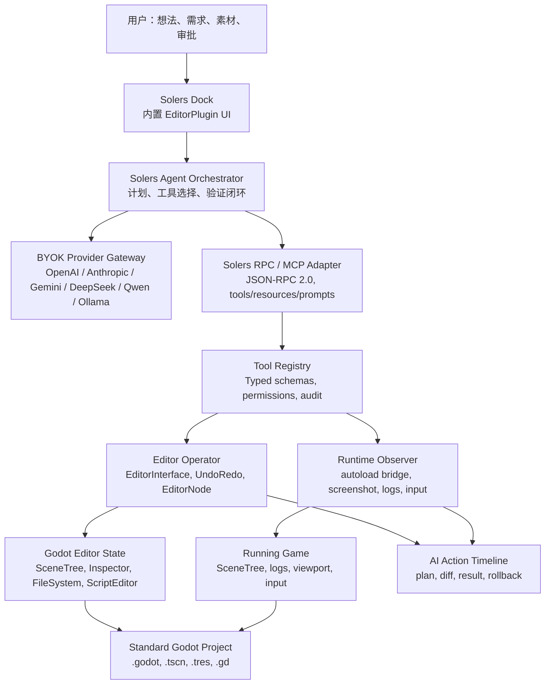

# Solers 引擎 v0.1 执行方案

版本：v0.1 planning draft  
基线：Godot `4.6.3-stable`，commit `35e80b3a8822a9df9be390814b62f44c0a9c69e8`  
源码目录：`F:\CodeHub\solers\godot-ai-native`  
目标：把 Solers 做成兼容 Godot 的 AI 原生游戏引擎发行版，而不是项目级聊天插件。

## 目录

1. 产品定义与 v0.1 北极星
2. 资料与源码调研结论
3. v0.1 架构总览
4. 模块划分
5. 通信协议与状态同步
6. 安全边界与权限模型
7. v0.1 MVP 范围
8. 核心技术实现路径
9. 目录结构建议
10. 关键代码框架示例
11. 增量开发 Phase
12. 工程化与质量保障
13. 兼容性与维护策略
14. 风险矩阵
15. 与竞品差异化
16. 后续路线图

## 1. 产品定义与 v0.1 北极星

Solers 是一个兼容 Godot 的 AI 原生游戏引擎发行版。它的核心不是“把聊天框塞进 Godot”，也不是让外部 IDE 盲写 `.gd`/`.tscn` 文件，而是让 AI 成为 Godot 编辑器内部的一等公民操作者。

v0.1 的北极星：

- AI 操作发生在真实 Godot Editor 状态上，而不是只修改磁盘文本。
- 所有变更尽可能走 Godot 原生 API、`EditorUndoRedoManager` 和资源保存流程。
- 用户拥有项目完整所有权，产物保持标准 Godot 项目格式。
- 默认 BYOK，支持本地和云端模型，但不把用户绑定到某个模型网关。
- 先做少量高质量工具，建立可靠闭环，再扩展到 90% 实用工作流。

v0.1 成功标准：

- 用户能在 Solers 内描述一个小型 2D/3D 原型需求。
- Solers 能生成计划，创建/修改场景树、写脚本、保存项目、运行当前场景、读取错误、截图验证，并把每一步记录到可回滚 Action Timeline。
- 用户可以随时停下 AI，手动接管，或者把项目放回标准 Godot 打开。

## 2. 资料与源码调研结论

### 2.1 官方文档依据

本方案参考了 Godot 官方文档与 MCP 官方规范：

- Godot EditorPlugin 文档：<https://docs.godotengine.org/en/4.6/classes/class_editorplugin.html>
- Godot EditorInterface 文档：<https://docs.godotengine.org/en/stable/classes/class_editorinterface.html>
- Godot 插件开发文档：<https://docs.godotengine.org/en/4.6/tutorials/plugins/editor/making_plugins.html>
- Godot GDExtension 文档：<https://docs.godotengine.org/en/stable/tutorials/scripting/gdextension/index.html>
- Godot build system 文档：<https://docs.godotengine.org/en/latest/engine_details/development/compiling/introduction_to_the_buildsystem.html>
- MCP 2025-11-25 specification：<https://modelcontextprotocol.io/specification/2025-11-25>

当前会话没有可调用 Context7 工具；调研通过 Tavily、Exa、Godot 官方文档、CodeGraph 与本地 `rg` 完成。

### 2.2 本地源码调研结论

CodeGraph 已索引：

```text
Files indexed: 9623
Total nodes: 273807
Total edges: 913957
Database size: 611.88 MB
```

Godot 4.6.3 中对 Solers v0.1 最重要的源码入口：

- `editor/editor_interface.h`
  - Godot 官方暴露给插件/脚本的编辑器操控入口。
  - 已覆盖场景打开/保存、运行、Inspector、FileSystem、ScriptEditor、Viewport、Selection 等。
- `editor/plugins/editor_plugin.h`
  - 编辑器插件生命周期、Dock、BottomPanel、菜单、导入/导出/Inspector/Debugger 插件入口。
- `editor/editor_undo_redo_manager.h`
  - 场景级和全局 undo/redo 管理。
  - v0.1 所有 AI 可变更操作必须优先通过它执行。
- `editor/editor_node.h`
  - 编辑器主控节点，负责插件注册、场景加载保存、菜单、日志、编辑器状态。
- `editor/docks/scene_tree_dock.h`
  - 场景树 Dock，内部已有大量 create/reparent/delete/replace/instantiate 的可参考事务写法。
- `editor/docks/filesystem_dock.h`
  - 文件系统 Dock，负责资源导航、移动、删除、刷新、选择变更。
- `editor/run/editor_run_bar.h`
  - 运行/停止当前场景、主场景、自定义场景。
- `editor/export/editor_export.h`
  - 导出 preset、export plugin、export platform。
- `scene/main/node.h` 与 `scene/main/scene_tree.h`
  - 运行时节点树与主循环。
- `core/io/resource_loader.h`、`core/io/resource_saver.h`、`core/io/resource.h`
  - 资源加载、保存、缓存。
- `core/object/class_db.h`
  - 类型系统、类名、方法绑定、扩展类。
- `modules/jsonrpc`
  - Godot 内置 JSON-RPC，可直接用于 Solers 内部协议骨架。
- `modules/websocket`
  - Godot 内置 WebSocketPeer，可用于 editor/runtime bridge。

关键源码事实：

- `EditorInterface::play_current_scene()` 直接转发到 `EditorRunBar::get_singleton()->play_current_scene()`。
- `EditorInterface::save_scene_as()` 直接转发到 `EditorNode::save_scene_to_path()`。
- `EditorPlugin::add_export_plugin()` 直接注册到 `EditorExport::get_singleton()->add_export_plugin()`。
- 内置 editor 插件可通过 `EditorPlugins::add_by_type<T>()` 注册；需要 editor singleton 初始化后执行的额外逻辑可使用 `EditorNode::add_init_callback()`。
- GDExtension 能做 native runtime/plugin 扩展，但对于 Solers 这种需要深度内部 editor 状态、统一内置发行版体验的目标，v0.1 应采用内置 C++ 模块注册 EditorPlugin，而不是仅依赖项目 addon。

## 3. v0.1 架构总览

Solers v0.1 采用“内置 C++ anchor + Godot 原生 EditorPlugin + JSON-RPC/MCP 兼容工具层 + 可选外部 provider gateway”的架构。



架构原则：

- **内核感知，不破坏内核**：v0.1 只补 Solers 必需入口，不重写 Godot 编辑器。
- **插件生命周期优先**：沿用 `EditorPlugin`、`EditorInterface`、`EditorUndoRedoManager`。
- **所有工具强类型**：每个工具有 schema、权限、幂等性标记、撤销策略和验证策略。
- **状态是事实源**：编辑器状态、运行时状态和磁盘文件共同组成事实源；模型输出只是建议。
- **用户可审计**：AI 每一步操作有时间线、输入、输出、错误、截图、影响文件、可回滚点。

## 4. 模块划分

### 4.1 `modules/solers_ai`

Solers 的 C++ 内置模块。v0.1 建议放在 Godot `modules` 下，原因是 Godot 对模块的注册、编译开关和 editor 初始化回调已有稳定机制。

职责：

- 注册 Solers 核心服务。
- 注册内置 `SolersEditorPlugin`。
- 提供 `SolersEditorBridge`、`SolersToolRegistry`、`SolersActionTimeline` 等 C++ 类。
- 封装 JSON-RPC/MCP 兼容协议。
- 提供少量不能可靠用 GDScript 实现的 editor 深状态能力。

### 4.2 `SolersEditorPlugin`

内置 EditorPlugin，是 Solers 在编辑器内的一等入口。

职责：

- 创建 Solers Dock。
- 初始化 provider 配置 UI。
- 启动/停止 Solers RPC 服务。
- 监听场景保存、资源保存、项目设置变化、运行状态变化。
- 将用户请求交给 Orchestrator。

### 4.3 `SolersToolRegistry`

工具注册中心。

职责：

- 注册工具定义。
- 暴露 MCP-compatible tools/list 与 tools/call。
- 执行权限检查。
- 调用对应 handler。
- 返回结构化结果和错误。

工具定义字段：

```text
name
description
input_schema
output_schema
permission
mutation_kind
requires_approval
undo_strategy
validation_strategy
timeout_ms
```

### 4.4 `SolersEditorOperator`

编辑器操作执行层。

职责：

- 封装 `EditorInterface`。
- 封装 `EditorUndoRedoManager`。
- 封装节点创建、删除、属性设置、脚本附加、资源保存。
- 保证工具结果可验证、可审计、尽可能可回滚。

### 4.5 `SolersRuntimeBridge`

运行时观测与控制层。

v0.1 采用项目 autoload 方式注入一个轻量运行时桥，类似当前 Godot MCP 项目中已验证的 editor/runtime 双通道模式，但实现必须更保守：

- 只在用户允许“运行时验证”时临时启用。
- 自动注册与自动移除。
- 不改变用户已有 autoload。
- 所有注入文件放在 `res://addons/solers/runtime/` 或自包含缓存目录。

职责：

- 运行时 SceneTree 读取。
- 运行时日志 ring buffer。
- 截图。
- 输入模拟。
- 节点属性读取。
- 后续可扩展为运行时断言、性能采样、测试录制。

### 4.6 `SolersProviderGateway`

模型供应商网关。

v0.1 支持 BYOK：

- OpenAI-compatible endpoint。
- Anthropic。
- Gemini。
- DeepSeek。
- Qwen/OpenRouter 兼容。
- Ollama/LM Studio 本地 OpenAI-compatible。

原则：

- API key 存在本机 editor settings 或 OS credential store，不写入项目。
- v0.1 不做云端账号体系。
- 每轮请求前估算上下文规模和潜在成本。
- 支持“隐私模式”：禁用外部网络，只允许本地模型。

### 4.7 `SolersActionTimeline`

AI Action Timeline 是 v0.1 的产品护城河。

职责：

- 记录 plan、tool call、tool result、影响对象、影响文件、错误、截图、验证结果。
- 每个 mutation 操作绑定 Godot UndoRedo action 或文件级 checkpoint。
- 支持按 step 回滚，至少支持回滚当前编辑器会话中的场景/属性操作。

## 5. 通信协议与状态同步

### 5.1 协议选择

v0.1 内部协议采用 JSON-RPC 2.0，并做 MCP 兼容适配。

原因：

- Godot 已有 `modules/jsonrpc`，减少协议实现风险。
- MCP 是 2026 年 AI 工具生态事实标准。
- JSON-RPC 易于日志、回放、测试和跨语言桥接。

### 5.2 传输选择

v0.1 支持两种传输：

1. 内部直接调用：Solers Dock 内的 agent 调用 `SolersToolRegistry`。
2. 本地 loopback RPC：`127.0.0.1` 上的 WebSocket 或 StreamPeerTCP，用于未来接 Codex/Claude/Cursor 等外部 agent。

v0.1 默认不暴露远程网络监听。只允许：

```text
host = 127.0.0.1
port = auto/random or 6517
auth = per-session token
```

### 5.3 MCP primitives 映射

Tools：

- 会修改或观察编辑器/运行时状态的操作。
- 例如 `scene.add_node`、`node.set_properties`、`runtime.capture_screenshot`。

Resources：

- 只读上下文。
- 例如当前场景树、打开脚本、项目结构、Godot 类文档索引、Action Timeline。

Prompts：

- 可复用 game-dev workflow。
- 例如 `make_2d_platformer_controller`、`debug_runtime_error`、`export_windows_build`。

Elicitation：

- 需要用户补充信息时使用。
- v0.1 可先在 Dock UI 中实现，不强依赖 MCP 客户端支持。

Sampling：

- MCP 2026 后续版本已有弃用趋势，v0.1 不依赖 sampling。

### 5.4 状态同步机制

Solers 要维护四类状态：

- Editor Snapshot：当前打开场景、选中节点、Inspector 对象、文件系统状态、运行状态。
- Runtime Snapshot：运行时节点树、日志、截图、输入状态。
- Project Index：脚本、场景、资源、项目设置、依赖关系。
- Conversation Memory：用户需求、设计约束、命名规范、风格板、已批准计划。

v0.1 实现策略：

- Editor Snapshot 按需读取，不做大规模常驻缓存。
- Project Index 使用增量扫描，优先 `rg` 风格快速文件索引和 Godot `EditorFileSystem`。
- Runtime Snapshot 只在运行时 bridge 连接后可用。
- Conversation Memory 存储在用户级 Solers 配置，不默认写进项目；项目级记忆需用户显式启用。

## 6. 安全边界与权限模型

v0.1 必须从第一天建立权限模型，否则 AI 操作者会变成不可控的“超级脚本”。

### 6.1 权限等级

```text
observe        只读：读取场景树、项目结构、日志、类文档
edit_scene     修改场景节点、属性、信号、分组
edit_files     创建/修改脚本、资源文本、配置文件
run_project    运行/停止项目，读取运行时状态
import_assets  导入外部素材，修改 import 设置
export_build   生成导出 preset，执行导出
network        访问外部网络、模型 API、Asset Store
shell          执行系统命令，v0.1 默认不开放
```

### 6.2 批准策略

默认自动批准：

- 只读观察工具。
- 不写磁盘的预览/分析工具。

默认需要用户批准：

- 创建/删除/移动文件。
- 批量修改多个场景/脚本。
- 导入外部素材。
- 运行导出。
- 任意网络资产下载。

v0.1 禁止：

- 任意 shell。
- 删除项目根目录外文件。
- 自动提交 Git。
- 自动上传项目代码到 Solers 云。
- 未经用户确认发送素材或源码到外部模型。

### 6.3 编辑锁与租约

竞品 Summer 在 2026 年引入 editor write lock 与 mutation lease，这是正确方向。Solers v0.1 应实现轻量版本：

- AI 执行 mutation turn 时，在 Dock 显示“AI 正在写入”。
- 用户可点击 Stop 取消后续工具调用。
- 工具执行期间避免并发 mutation。
- 每次 mutation 持有短租约，超时自动释放。
- 工具必须支持取消或超时返回。

## 7. v0.1 MVP 范围

v0.1 坚持“30 个高质量工具，不做 150 个泛工具”。

### 7.1 P0 必须包含

Project/Context：

- `project.get_info`
- `project.list_files`
- `project.search_files`
- `project.read_file`
- `project.get_settings_summary`

Scene：

- `scene.get_open_scenes`
- `scene.open`
- `scene.get_tree`
- `scene.create`
- `scene.save`
- `scene.save_as`

Node：

- `node.get_properties`
- `node.add`
- `node.remove`
- `node.reparent`
- `node.set_properties`
- `node.attach_script`
- `node.connect_signal`
- `node.list_signal_connections`

Script：

- `script.create`
- `script.read`
- `script.patch`
- `script.validate`
- `script.open_in_editor`

Runtime：

- `runtime.play_current_scene`
- `runtime.stop`
- `runtime.get_status`
- `runtime.get_logs`
- `runtime.capture_screenshot`

Validation：

- `validation.read_editor_errors`
- `validation.run_scene_smoke`
- `validation.assert_no_errors`

Timeline：

- `timeline.list_actions`
- `timeline.rollback_last`

Provider/UI：

- BYOK 配置。
- 模型选择。
- 隐私模式。
- 工具权限面板。

### 7.2 P1 可以包含

- `resource.get_info`
- `resource.set_property`
- `asset.import_file`
- `asset.search_project_assets`
- `input.send_action`
- `input.send_key`
- `test.run_gdunit` 或 convention-based test runner。
- `export.list_presets`
- `export.validate_presets`

### 7.3 v0.1 明确不包含

- 任意 shell tool。
- 自动发布到 Steam/itch.io。
- 云端团队协作。
- 多人实时协同。
- 复杂 3D 资产生成链路。
- 大规模 TileMap 自动绘制。
- 完整 C# 项目构建和 NuGet 管理。
- 对所有 Godot Editor 菜单项的 1:1 自动化。
- 远程公网 MCP server。

## 8. 核心技术实现路径

### 8.1 为什么不是纯 addon

纯 addon 的问题：

- 用户每个项目都要安装插件，不符合“Solers 发行版”定义。
- 安全模型与权限 UI 不能成为引擎默认能力。
- 与启动面板、Project Manager、全局设置、未来导出模板分发的集成不足。
- 难以建立统一日志、Timeline、provider gateway 和全局 onboarding。

### 8.2 为什么不是一开始深改 EditorNode

深改 EditorNode 的问题：

- upstream rebase 成本极高。
- Godot editor 初始化和生命周期复杂，早期深改容易破坏稳定性。
- 很多能力已经通过 `EditorInterface` 和 `EditorPlugin` 暴露。

### 8.3 推荐路线

v0.1 使用“内置模块注册 EditorPlugin”：

- 新建 `modules/solers_ai`。
- 使用 `EditorPlugins::add_by_type<SolersEditorPlugin>()` 注册内置 Solers plugin。
- 对需要 `EditorNode::get_singleton()` 已经可用的启动逻辑，再使用 `EditorNode::add_init_callback()`。
- `SolersEditorPlugin` 继承 `EditorPlugin`。
- UI、工具、协议、provider gateway 都从该 plugin 进入。
- 少量核心类用 C++ 实现，复杂 UI 可先用 Godot Control/GDScript 子资源或 C++ Control。

这样同时满足：

- 是引擎内置能力。
- 不污染项目。
- 使用 Godot 原生生命周期。
- 后续可渐进式下沉到 Editor API。

## 9. 目录结构建议

Godot fork 内：

```text
godot-ai-native/
  modules/
    solers_ai/
      SCsub
      config.py
      register_types.h
      register_types.cpp
      editor/
        solers_editor_plugin.h
        solers_editor_plugin.cpp
        solers_dock.h
        solers_dock.cpp
        solers_settings.h
        solers_settings.cpp
      core/
        solers_agent_orchestrator.h
        solers_agent_orchestrator.cpp
        solers_tool_registry.h
        solers_tool_registry.cpp
        solers_tool_context.h
        solers_tool_context.cpp
        solers_tool_result.h
        solers_tool_result.cpp
        solers_action_timeline.h
        solers_action_timeline.cpp
        solers_permission_manager.h
        solers_permission_manager.cpp
      protocol/
        solers_rpc_server.h
        solers_rpc_server.cpp
        solers_mcp_adapter.h
        solers_mcp_adapter.cpp
        solers_json_schema.h
        solers_json_schema.cpp
      tools/
        solers_project_tools.h
        solers_project_tools.cpp
        solers_scene_tools.h
        solers_scene_tools.cpp
        solers_node_tools.h
        solers_node_tools.cpp
        solers_script_tools.h
        solers_script_tools.cpp
        solers_runtime_tools.h
        solers_runtime_tools.cpp
        solers_validation_tools.h
        solers_validation_tools.cpp
      runtime/
        solers_runtime_bridge.gd
        solers_runtime_bridge.tscn
      doc_classes/
        SolersToolRegistry.xml
        SolersActionTimeline.xml
```

Solers workspace 内：

```text
F:\CodeHub\solers\
  SOLERS_ARCHITECTURE.md
  SOLERS_V0_1_EXECUTION_PLAN.md
  BUILD_SETUP_REPORT.md
  validation/
    godot-smoke-project/
  build_logs/
  tools/
    solers_mcp_gateway/
      pyproject.toml
      solers_mcp_gateway/
        __init__.py
        server.py
        schemas.py
        providers/
```

说明：

- v0.1 的核心内置在 C++ 模块中。
- Python gateway 可选，只用于外部 MCP client 或 provider 开发调试；引擎本体不能依赖用户安装 Python。
- 运行时 bridge 以 Godot 资源形式打包进模块，按需复制或内嵌加载。

## 10. 关键代码框架示例

以下是方向性框架，不是直接可编译最终实现。

### 10.1 模块注册

```cpp
// modules/solers_ai/register_types.cpp
#include "register_types.h"

#include "core/object/class_db.h"
#include "editor/plugins/editor_plugin.h"
#include "modules/solers_ai/editor/solers_editor_plugin.h"

void initialize_solers_ai_module(ModuleInitializationLevel p_level) {
	if (p_level == MODULE_INITIALIZATION_LEVEL_SCENE) {
		GDREGISTER_CLASS(SolersToolRegistry);
		GDREGISTER_CLASS(SolersActionTimeline);
		GDREGISTER_CLASS(SolersPermissionManager);
	}

#ifdef TOOLS_ENABLED
	if (p_level == MODULE_INITIALIZATION_LEVEL_EDITOR) {
		GDREGISTER_CLASS(SolersEditorPlugin);
		EditorPlugins::add_by_type<SolersEditorPlugin>();
	}
#endif
}

void uninitialize_solers_ai_module(ModuleInitializationLevel p_level) {
}
```

### 10.2 EditorPlugin anchor

```cpp
// modules/solers_ai/editor/solers_editor_plugin.h
#pragma once

#include "editor/plugins/editor_plugin.h"

class SolersDock;
class SolersToolRegistry;
class SolersRpcServer;

class SolersEditorPlugin : public EditorPlugin {
	GDCLASS(SolersEditorPlugin, EditorPlugin);

	SolersDock *dock = nullptr;
	SolersToolRegistry *tool_registry = nullptr;
	SolersRpcServer *rpc_server = nullptr;

protected:
	static void _bind_methods();

public:
	virtual String get_plugin_name() const override { return "Solers"; }
	virtual void make_visible(bool p_visible) override;

	void _notification(int p_what);

	SolersEditorPlugin();
	~SolersEditorPlugin();
};
```

```cpp
// modules/solers_ai/editor/solers_editor_plugin.cpp
#include "solers_editor_plugin.h"

#include "modules/solers_ai/editor/solers_dock.h"
#include "modules/solers_ai/core/solers_tool_registry.h"
#include "modules/solers_ai/protocol/solers_rpc_server.h"

void SolersEditorPlugin::_bind_methods() {}

void SolersEditorPlugin::make_visible(bool p_visible) {
	if (dock) {
		dock->set_visible(p_visible);
	}
}

void SolersEditorPlugin::_notification(int p_what) {
	if (p_what == NOTIFICATION_ENTER_TREE) {
		tool_registry = memnew(SolersToolRegistry);
		tool_registry->register_default_tools();

		rpc_server = memnew(SolersRpcServer);
		rpc_server->set_tool_registry(tool_registry);
		rpc_server->start_loopback();

		dock = memnew(SolersDock);
		dock->set_tool_registry(tool_registry);
		add_control_to_dock(DOCK_SLOT_RIGHT_BL, dock);
	}

	if (p_what == NOTIFICATION_EXIT_TREE) {
		if (dock) {
			remove_control_from_docks(dock);
			memdelete(dock);
			dock = nullptr;
		}
		if (rpc_server) {
			rpc_server->stop();
			memdelete(rpc_server);
			rpc_server = nullptr;
		}
		if (tool_registry) {
			memdelete(tool_registry);
			tool_registry = nullptr;
		}
	}
}

SolersEditorPlugin::SolersEditorPlugin() {}
SolersEditorPlugin::~SolersEditorPlugin() {}
```

### 10.3 工具定义与结果类型

```cpp
enum class SolersPermission {
	OBSERVE,
	EDIT_SCENE,
	EDIT_FILES,
	RUN_PROJECT,
	IMPORT_ASSETS,
	EXPORT_BUILD,
	NETWORK,
	SHELL,
};

enum class SolersMutationKind {
	NONE,
	EDITOR_UNDO_REDO,
	FILE_PATCH,
	RUNTIME_ONLY,
	EXPORT_ARTIFACT,
};

struct SolersToolDefinition {
	StringName name;
	String description;
	Dictionary input_schema;
	Dictionary output_schema;
	SolersPermission permission = SolersPermission::OBSERVE;
	SolersMutationKind mutation_kind = SolersMutationKind::NONE;
	bool requires_approval = false;
	int timeout_ms = 10000;
};

struct SolersToolResult {
	bool ok = false;
	Variant data;
	String error_code;
	String error_message;
	Dictionary diagnostics;
	Dictionary timeline_patch;
};
```

### 10.4 工具注册中心

```cpp
class SolersToolRegistry : public Object {
	GDCLASS(SolersToolRegistry, Object);

	HashMap<StringName, SolersToolDefinition> definitions;
	HashMap<StringName, Callable> handlers;

protected:
	static void _bind_methods();

public:
	void register_tool(const SolersToolDefinition &p_def, const Callable &p_handler);
	Dictionary list_tools() const;
	Dictionary call_tool(const StringName &p_name, const Dictionary &p_args);
	void register_default_tools();
};
```

### 10.5 节点属性修改工具

```cpp
Dictionary SolersNodeTools::set_properties(const Dictionary &p_args) {
	const NodePath node_path = p_args["node_path"];
	const Dictionary properties = p_args["properties"];

	EditorInterface *ei = EditorInterface::get_singleton();
	Node *root = ei->get_edited_scene_root();
	ERR_FAIL_NULL_V_MSG(root, _error("NO_SCENE", "No edited scene root."));

	Node *node = root->get_node_or_null(node_path);
	ERR_FAIL_NULL_V_MSG(node, _error("NODE_NOT_FOUND", "Node path not found."));

	EditorUndoRedoManager *ur = ei->get_editor_undo_redo();
	ur->create_action("Solers: Set Node Properties", UndoRedo::MERGE_DISABLE, node);

	for (const Variant *key = properties.next(nullptr); key; key = properties.next(key)) {
		StringName property = *key;
		Variant old_value = node->get(property);
		Variant new_value = properties[property];

		ur->add_do_property(node, property, new_value);
		ur->add_undo_property(node, property, old_value);
	}

	ur->commit_action();

	Dictionary out;
	out["node_path"] = node_path;
	out["changed_count"] = properties.size();
	return _ok(out);
}
```

### 10.6 GDScript 运行时 bridge

```gdscript
@tool
extends Node

const MAX_LOG_LINES := 500

var _logs: Array[String] = []
var _socket := WebSocketPeer.new()
var _connected := false

func _ready() -> void:
	if Engine.is_editor_hint():
		return
	print("SOLERS_RUNTIME_BRIDGE_READY")
	_connect_to_editor()

func _process(_delta: float) -> void:
	if _socket.get_ready_state() != WebSocketPeer.STATE_CLOSED:
		_socket.poll()
		_drain_packets()

func _connect_to_editor() -> void:
	var port := ProjectSettings.get_setting("solers/runtime_bridge/port", 0)
	var token := ProjectSettings.get_setting("solers/runtime_bridge/token", "")
	if port == 0 or token == "":
		return
	var err := _socket.connect_to_url("ws://127.0.0.1:%d/runtime?token=%s" % [port, token])
	if err != OK:
		push_warning("Solers runtime bridge failed to connect: %s" % err)

func capture_screenshot(path: String) -> Dictionary:
	await get_tree().process_frame
	await get_tree().process_frame
	var image := get_viewport().get_texture().get_image()
	var err := image.save_png(path)
	return {
		"ok": err == OK,
		"path": path,
		"error": err,
	}

func query_node(path: NodePath, properties: Array[String]) -> Dictionary:
	var node := get_node_or_null(path)
	if node == null:
		return {"ok": false, "error": "NODE_NOT_FOUND", "path": str(path)}
	var result := {}
	for property in properties:
		result[property] = node.get(property)
	return {"ok": true, "path": str(path), "properties": result}
```

### 10.7 Python MCP gateway 原型

这个 gateway 只作为开发辅助或外部 agent 连接方式，不是 v0.1 引擎运行硬依赖。

```python
from mcp.server.fastmcp import FastMCP
import asyncio
import json
import websockets

mcp = FastMCP("solers")

SOLERS_URL = "ws://127.0.0.1:6517/mcp"

async def call_solers(method: str, params: dict):
    async with websockets.connect(SOLERS_URL) as ws:
        req = {"jsonrpc": "2.0", "id": 1, "method": method, "params": params}
        await ws.send(json.dumps(req))
        return json.loads(await ws.recv())

@mcp.tool()
async def scene_get_tree(depth: int = 8) -> dict:
    return await call_solers("tools/call", {
        "name": "scene.get_tree",
        "arguments": {"depth": depth},
    })

@mcp.tool()
async def runtime_capture_screenshot() -> dict:
    return await call_solers("tools/call", {
        "name": "runtime.capture_screenshot",
        "arguments": {},
    })

if __name__ == "__main__":
    mcp.run()
```

## 11. 增量开发 Phase

### Phase 0：发行版基础与内置入口

交付物：

- `modules/solers_ai` 可编译。
- `SolersEditorPlugin` 自动出现在 Solers Editor。
- Solers Dock 基础 UI。
- BYOK 设置页。
- 自包含 editor settings。
- 构建命令和 smoke 测试文档。

风险点：

- 模块注册生命周期不稳定。
- Editor 初始化顺序访问 singleton 过早。

验证：

- `scons platform=windows target=editor dev_build=yes debug_symbols=yes arch=x86_64 -j8`
- 启动 editor，确认 Solers Dock 可见。
- `--headless --editor` smoke。

### Phase 1：工具注册与只读上下文

交付物：

- `SolersToolRegistry`。
- JSON-RPC `tools/list`、`tools/call`。
- 只读工具：project info、file search、scene tree、open scenes、selected node、editor logs。
- Action Timeline 只读记录。

风险点：

- 场景树大型项目输出过大。
- 模型上下文爆炸。

验证：

- 单元测试工具 schema。
- 大场景 depth/limit/filter 测试。
- 工具结果 JSON 稳定快照测试。

### Phase 2：场景与节点 mutation

交付物：

- `node.add/remove/reparent/set_properties/attach_script/connect_signal`。
- 所有 mutation 走 `EditorUndoRedoManager`。
- Timeline 记录每步影响。
- `timeline.rollback_last`。

风险点：

- owner 设置错误导致保存后节点丢失。
- signal connection 没有持久化到 `.tscn`。
- 删除打开资源/场景导致崩溃。

验证：

- 修改后保存，再重新打开场景验证。
- `[connection]` entry 持久化检查。
- Undo/Redo 手工和自动测试。

### Phase 3：脚本写入与诊断闭环

交付物：

- `script.create/read/patch/validate/open_in_editor`。
- GDScript 语法/类型错误读取。
- 变更 diff 预览。
- 失败自动回传给 agent。

风险点：

- 盲目覆盖用户未保存脚本。
- patch 冲突。
- LLM 幻觉 Godot API。

验证：

- 文件 dirty 状态检查。
- patch 前后 hash 检查。
- 运行 `script.validate` 后再允许 agent 报告完成。

### Phase 4：运行时验证

交付物：

- runtime autoload bridge。
- `runtime.play_current_scene/stop/get_status/get_logs/capture_screenshot`。
- `validation.run_scene_smoke`。
- 截图结果进入 Timeline。

风险点：

- autoload 注入污染项目。
- WebSocket 超时导致 editor 卡住。
- wait 阻塞主线程。

验证：

- bridge 自动注册/移除。
- 运行后截图非空。
- 非阻塞 timer 测试。
- 20s timeout cap。

### Phase 5：Agent Orchestrator

交付物：

- Planner -> Executor -> Verifier -> Reporter 四段式 turn。
- 每轮计划可编辑/批准。
- 每个 mutation 前可显示影响摘要。
- 错误时自动进入修复循环，最多 N 次。

风险点：

- agent 长任务失控。
- 用户不清楚 AI 在做什么。

验证：

- Demo：创建简单 2D platformer 原型。
- Demo：修复脚本错误。
- Demo：运行、截图、验证无错误。

## 12. 工程化与质量保障

### 12.1 构建系统

新增 `modules/solers_ai/SCsub` 和 `config.py`，遵循 Godot 模块惯例。

要求：

- 默认启用在 Solers 发行版。
- 可通过 SCons 参数禁用：`module_solers_ai_enabled=no`。
- 不引入强制网络依赖。
- 不下载第三方依赖。
- Windows/macOS/Linux 构建路径一致。

### 12.2 测试策略

C++ 单元测试：

- Tool schema 验证。
- Permission manager。
- JSON-RPC request/response。
- Action Timeline serialization。

Editor smoke：

- 启动 editor。
- Solers Dock 初始化。
- tools/list 返回稳定结果。
- scene.get_tree 对空项目可用。

Mutation integration：

- 创建场景。
- 添加节点。
- 设置属性。
- 保存。
- 重新打开。
- Undo/Redo。

Runtime smoke：

- 运行当前场景。
- runtime bridge 连接。
- 截图。
- 读取 logs。
- stop。

### 12.3 日志与可调试性

日志分层：

- Solers UI log：用户可读。
- Solers tool log：工具调用、耗时、结果。
- Solers protocol log：JSON-RPC 消息，默认隐藏敏感字段。
- Godot editor log：原始 Godot 输出。
- Timeline：产品级审计记录。

敏感信息处理：

- API key 永不进入 protocol log。
- prompt 中附带文件要列出清单。
- 网络请求前显示 provider、模型、上下文大小估计。

### 12.4 错误处理

所有工具返回统一错误结构：

```json
{
  "ok": false,
  "error": {
    "code": "NODE_NOT_FOUND",
    "message": "Node path not found: /root/Main/Player",
    "recoverable": true,
    "suggested_next_tools": ["scene.get_tree"]
  },
  "diagnostics": {}
}
```

错误分类：

- `INVALID_ARGUMENT`
- `PERMISSION_DENIED`
- `USER_APPROVAL_REQUIRED`
- `EDITOR_BUSY`
- `NODE_NOT_FOUND`
- `RESOURCE_NOT_FOUND`
- `SCRIPT_PARSE_ERROR`
- `RUNTIME_NOT_CONNECTED`
- `TIMEOUT`
- `INTERNAL_ERROR`

## 13. 兼容性与维护策略

Solers v0.1 兼容策略：

- 项目文件保持 Godot 标准格式。
- 不写入 Solers 专有 scene/resource 字段。
- Solers metadata 默认写入 `.godot/solers/` 或用户配置目录，不影响官方 Godot 打开项目。
- 所有项目级注入都必须可撤销。
- GDScript/C# 原有项目不要求迁移。

Upstream 策略：

- 保持 `solers/4.6.3-ai-native-base` 干净。
- 新建功能分支。
- Solers 核心尽量集中在 `modules/solers_ai`。
- 修改 Godot 原有文件必须有架构理由和注释。
- 每次 rebase 后跑 build + smoke + mutation integration。

## 14. 风险矩阵

| 风险 | 级别 | 表现 | 规避 |
| --- | --- | --- | --- |
| 过早深 fork | 高 | 难以跟踪 Godot 4.7+ | v0.1 集中在模块和插件生命周期 |
| AI 误删/误改 | 高 | 用户项目损坏 | 权限、审批、UndoRedo、文件 checkpoint |
| 工具过多低质 | 高 | agent 选择混乱 | v0.1 控制在 30 个高质量工具 |
| 运行时 bridge 污染项目 | 中高 | 官方 Godot 打开项目有残留 | 自动注册/移除，用户确认，固定目录 |
| 主线程阻塞 | 中高 | Editor 卡死 | 非阻塞 await/timer，工具 timeout，取消 |
| 上下文爆炸 | 中 | 大项目成本高、响应差 | depth/limit/filter，索引摘要，按需读取 |
| 模型幻觉 API | 中 | 生成不存在的 GDScript | Godot docs resource、ClassDB 查询、script.validate |
| BYOK 泄漏 | 高 | API key 出现在日志/项目 | OS credential store，日志脱敏 |
| 许可/品牌风险 | 中 | Godot 商标、第三方素材 | 遵守 MIT，换品牌，保留版权，素材 license tracking |
| 竞品速度快 | 中 | Summer/Ziva/Godot MCP 迭代快 | 主打开源可信、BYOK、可审计、兼容 upstream |

## 15. 与竞品差异化

### Godot AI MCP / Godot MCP Pro / GDAI MCP

它们多数是项目 addon + 外部 MCP server。优点是轻量、快、能接 Claude/Cursor；缺点是工具桥属性强，不是 engine distribution。

Solers 差异：

- 发行版内置，不需要每个项目装桥。
- 有统一权限、Timeline、编辑锁和 provider gateway。
- C++ 层可补 Editor API 边界。
- 不追求 160+ 工具，追求强验证闭环。

### Ziva

Ziva 是成熟的 in-editor agent，强调 Godot docs、错误分析、场景工具、测试、截图、模型服务。

Solers 差异：

- BYOK 和本地模型是一等路线。
- 源码发行版可审计。
- 更底层的 engine operator，不只是项目插件。
- Action Timeline 与权限模型从 v0.1 内建。

### Summer Engine

Summer 是最接近的竞品。公开资料显示其重视 AI write lock、mutation leases、run-and-verify、skills、MCP、Godot 兼容和资产生成。

Solers 差异方向：

- 开源可信与可私有化。
- 不锁模型，不强制云账号。
- 更强调标准 Godot upstream 兼容。
- 专业团队可审计的工具 schema、日志、权限和回滚。

### Blured Engine

Blured 是 Godot fork + built-in AI server，方向接近，但仍处早期。

Solers 要赢在：

- 工程纪律。
- 可维护 fork。
- 稳定 rebase。
- UndoRedo 和验证闭环。
- 安全边界。
- 清晰商业化，而不是只做“一句话生成游戏”的演示。

## 16. 后续路线图

### v0.1：可信操作者闭环

- 内置 Solers Dock。
- BYOK。
- 30 个核心工具。
- Action Timeline。
- Editor mutation + Runtime validation。
- 简单 demo 原型可端到端完成。

### v0.2：资源与导出

- Resource graph。
- Import settings 操作。
- Asset license tracking。
- Export preset 创建/验证。
- Windows/macOS/Linux desktop export smoke。

### v0.3：技能包

- Platformer skill。
- Top-down skill。
- Card game skill。
- Dialogue system skill。
- Inventory skill。
- UI menu skill。

### v0.4：多 Agent

- Planner。
- Scene Builder。
- Script Engineer。
- Asset Curator。
- Playtester。
- Exporter。

### v0.5：团队与私有化

- Local model gateway。
- Team policy。
- Project memory。
- Organization templates。
- Private model routing。

### v1.0：90% 实用工作流

- 场景、脚本、资源、导入、运行、测试、导出完整闭环。
- 一键从 idea 到 playable prototype。
- 专业开发者可审计、可回滚、可接管。
- 标准 Godot 项目无锁定。

## 结论

Solers v0.1 的正确路线不是做一个更大的聊天插件，也不是立即深改 Godot 内核。正确路线是：在 Godot 4.6.3 稳定源码之上，新建 `modules/solers_ai`，用内置 C++ 模块注册 `SolersEditorPlugin`，把 AI 操作者、工具注册、权限、Timeline、运行时验证和 BYOK 网关作为引擎发行版的原生能力建立起来。

v0.1 的目标不是“AI 完整做出商业游戏”，而是建立可信闭环：观察真实引擎状态，执行原生编辑器操作，保存标准 Godot 项目，运行并验证结果，失败时带着错误和截图继续修复，所有过程可审计、可停止、可回滚。这个闭环一旦成立，Solers 后续扩展到 90% Godot 工作流就有坚实地基。
